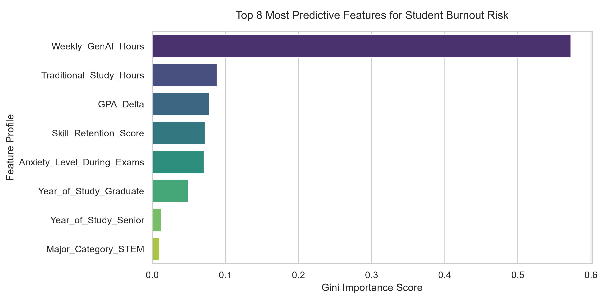
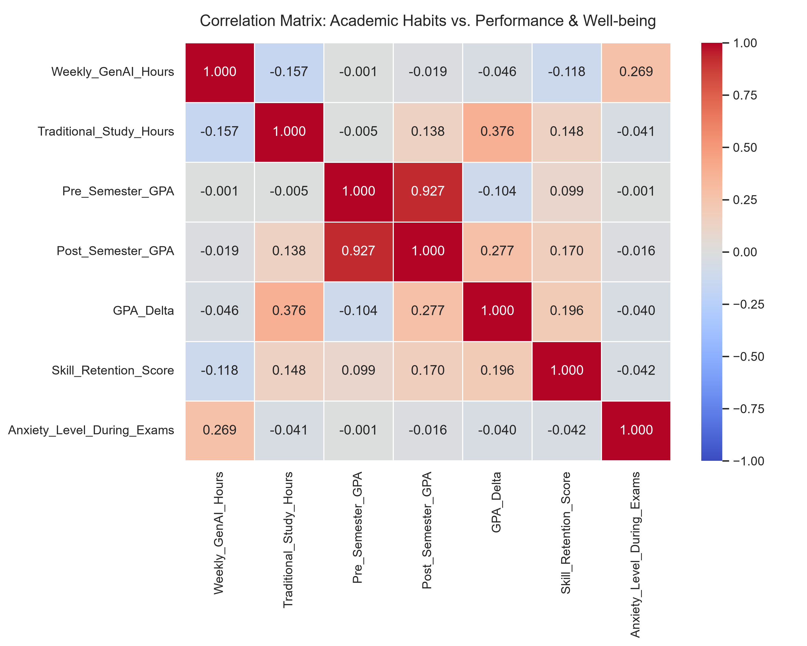

#  The Architecture of AI Adoption: Quantifying Student Performance & Burnout Risk

##  Project Overview

This Data Analytics and Machine Learning project explores how the increasing adoption of Generative AI tools affects academic performance and psychological well-being among college students.

Using a dataset of **50,000 student records**, the analysis investigates the relationship between:

* AI usage intensity (`Weekly_GenAI_Hours`)
* Prompt engineering proficiency
* Traditional study habits
* Academic performance changes (`GPA_Delta`)
* Burnout risk indicators

The project combines exploratory data analysis, feature engineering, statistical correlation analysis, and machine learning classification to identify the key factors associated with student burnout.

---

##  Business Problem

Generative AI tools have become deeply integrated into modern education. While these tools can improve productivity and learning efficiency, excessive dependence may influence study behavior, academic outcomes, and mental well-being.

The objective of this project is to answer three key questions:

1. Does increased AI usage improve academic performance?
2. How does AI adoption affect traditional study habits?
3. Can student burnout risk be predicted using behavioral and academic indicators?

---

##  Dataset Information

**Dataset Size:** 50,000 Records

### Features Included

| Category              | Variables                                                                         |
| --------------------- | --------------------------------------------------------------------------------- |
| Demographics          | Student_ID, Major_Category, Year_of_Study                                         |
| AI Usage              | Weekly_GenAI_Hours, Primary_Use_Case, Prompt_Engineering_Skill, Paid_Subscription |
| Academic Metrics      | Pre_Semester_GPA, Post_Semester_GPA, Skill_Retention_Score                        |
| Psychological Metrics | Anxiety_Level_During_Exams, Burnout_Risk_Level                                    |
| Engineered Features   | GPA_Delta                                                                         |

### Target Variable

`Burnout_Risk_Level`

Classes:

* Low
* Medium
* High

---

##  Project Workflow

### Phase 1: Data Cleaning & Feature Engineering

Key preprocessing steps:

* Removed unwanted ghost columns from CSV imports
* Converted incorrectly typed numerical variables
* Handled missing values using median imputation
* Engineered new feature:

```python
GPA_Delta = Post_Semester_GPA - Pre_Semester_GPA
```

---

### Phase 2: Exploratory Data Analysis

Performed statistical analysis to identify patterns between:

* AI usage and GPA improvement
* AI usage and study habits
* Anxiety levels and burnout risk
* Prompt engineering skill and academic outcomes

Methods used:

* Correlation Analysis
* Descriptive Statistics
* Distribution Analysis
* Feature Importance Evaluation

---

### Phase 3: Predictive Machine Learning

A Random Forest Classification model was developed to predict student burnout risk.

#### Preprocessing Pipeline

* One-Hot Encoding for categorical variables
* Standard Scaling for numerical features
* Stratified Train-Test Split (80-20)

#### Model

```python
RandomForestClassifier(
    n_estimators=100,
    max_depth=10,
    random_state=42
)
```

---

## 📈 Key Findings

### 1. AI Usage Is the Strongest Burnout Predictor

Weekly_GenAI_Hours emerged as the most influential predictor of burnout risk.

### Feature Importance Visualization



---

### 2. AI Impact On GPA


---

### 3. Correlation Analysis



---

## 🎯 Model Performance

| Metric | Value |
|----------|----------|
| Model | Random Forest Classifier |
| Dataset Size | 50,000 |
| Target Classes | Low, Medium, High |
| Accuracy | 51% |


---

##  Technologies Used

* Python
* Pandas
* NumPy
* Scikit-Learn
* Matplotlib
* Seaborn
* Jupyter Notebook

---

## 🧑‍💻 Future Improvements

* Compare multiple classification algorithms
* Perform hyperparameter optimization
* Deploy an interactive dashboard using Streamlit
* Implement model explainability using SHAP values
* Create real-time burnout risk prediction interface

---

## 👺 Project Outcome

This project demonstrates an end-to-end data science workflow involving:

* Data Cleaning
* Feature Engineering
* Exploratory Data Analysis
* Statistical Interpretation
* Machine Learning Classification
* Insight Generation

The results highlight that responsible and strategic AI adoption is more important than simple usage volume when evaluating student performance and well-being.
